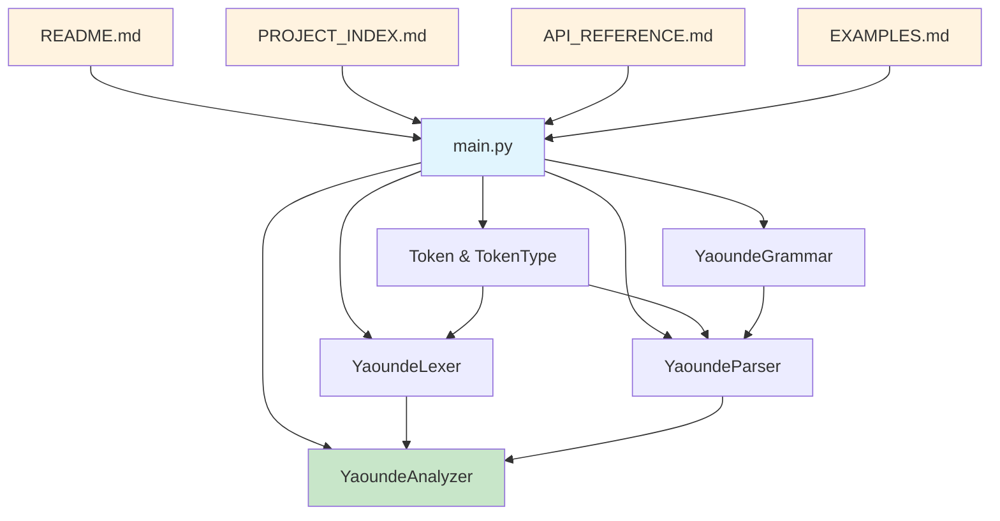

# File Structure Overview

## 📁 Project Files

| File | Size | Purpose | Status |
|------|------|---------|---------|
| `main.py` | 85 lines | Main orchestrator (modular) | ✅ Refactored |
| `lexical_analyzer.py` | 200 lines | Yaoundé multilingual tokenizer | ✅ Separated |
| `syntactic_analyzer.py` | 190 lines | Grammar engine and parser | ✅ Separated |
| `Lexer code/` | 309+ lines | Traffic light lexical analyzers | ✅ Complete |
| └── `lexical_analyzer.py` | 159 lines | Full DFA traffic lexer | ✅ Complete |
| └── `lexical_analyzer2.py` | 50 lines | Compact traffic validator | ✅ Complete |
| └── `lexical_analyzer3.py` | 100 lines | Cameroonian traffic rules | ✅ Complete |
| `README.md` | 123 lines | Project overview | ✅ Created |
| `PROJECT_INDEX.md` | 340+ lines | Detailed index (updated) | ✅ Updated |
| `API_REFERENCE.md` | 456 lines | API documentation | ✅ Created |
| `EXAMPLES.md` | 512 lines | Usage examples | ✅ Created |
| `FILE_STRUCTURE.md` | This file | Structure overview | ✅ Current |

## 🧩 Code Distribution

### Modular Architecture (Separated Components)

#### Main Orchestrator (main.py - 85 lines)
```
├── Imports & Setup (10 lines)
│   ├── Component Imports
│   └── Type Definitions
├── YaoundeAnalyzer Class (50 lines)
│   ├── Component Integration (25 lines)
│   └── Analysis Orchestration (25 lines)
└── Demo & Test Cases (25 lines)
    └── Sample Expressions & Main
```

#### Lexical Component (lexical_analyzer.py - 200 lines)
```
├── Token System (70 lines)
│   ├── TokenType Enum (50 lines)
│   └── Token Dataclass (20 lines)
├── YaoundeLexer Class (100 lines)
│   ├── Pattern Definitions (80 lines)
│   ├── Tokenization Logic (15 lines)
│   └── Frequency Analysis (5 lines)
└── Testing Module (30 lines)
    └── Standalone Tests
```

#### Syntactic Component (syntactic_analyzer.py - 190 lines)
```
├── YaoundeGrammar Class (120 lines)
│   ├── Grammar Rules (30 lines)
│   ├── FIRST Sets (30 lines)
│   ├── FOLLOW Sets (30 lines)
│   └── LL(1) Table (30 lines)
├── YaoundeParser Class (50 lines)
│   ├── Parse Methods (35 lines)
│   └── Helper Functions (15 lines)
└── Testing Module (20 lines)
    └── Standalone Tests
```

### Lexer Code Folder (309+ lines)
```
├── lexical_analyzer.py (159 lines)
│   ├── Token Class (15 lines)
│   ├── Lexer Class (45 lines)
│   ├── Validator Class (65 lines)
│   └── Main & Demo (34 lines)
├── lexical_analyzer2.py (50 lines)
│   ├── DFA Transition Table (10 lines)
│   ├── Lexer Function (25 lines)
│   └── Main & Tests (15 lines)
└── lexical_analyzer3.py (100 lines)
    ├── Token Mapping (10 lines)
    ├── DFA Table & Logic (45 lines)
    ├── Validation Functions (25 lines)
    └── Main & Test Cases (20 lines)
```

## 📚 Documentation Distribution

```
├── README.md (123 lines)
│   ├── Overview & Features (40 lines)
│   ├── Architecture (30 lines)  
│   ├── Token Categories (25 lines)
│   └── Usage & Examples (28 lines)
├── PROJECT_INDEX.md (284 lines)
│   ├── File Structure (20 lines)
│   ├── Code Organization (80 lines)
│   ├── Token Categories (60 lines)
│   ├── Grammar Rules (40 lines)
│   ├── Class Details (50 lines)
│   └── Technical Specs (34 lines)
├── API_REFERENCE.md (456 lines)
│   ├── Core Classes (80 lines)
│   ├── YaoundeLexer (70 lines)
│   ├── YaoundeGrammar (60 lines)
│   ├── YaoundeParser (80 lines)
│   ├── YaoundeAnalyzer (40 lines)
│   ├── Data Structures (60 lines)
│   ├── Quick Start (40 lines)
│   └── Extensions (26 lines)
└── EXAMPLES.md (512 lines)
    ├── Quick Start (40 lines)
    ├── Expression Categories (120 lines)
    ├── Advanced Tokenization (80 lines)
    ├── Grammar Exploration (60 lines)
    ├── Multilingual Examples (80 lines)
    ├── Custom Extensions (50 lines)
    ├── Batch Processing (40 lines)
    ├── Educational Use (36 lines)
    └── Debugging & Validation (46 lines)
```

## 🎯 Component Dependencies



## 📊 Feature Coverage

### Core Features ✅
- [x] Multilingual tokenization (6 languages)
- [x] 40+ token types
- [x] Context-free grammar (15 rules)
- [x] LL(1) parsing
- [x] FIRST/FOLLOW set computation
- [x] Parse tree generation
- [x] Frequency analysis
- [x] Pretty-printed output

### Language Support ✅
- [x] English (base language)
- [x] French (contractions, phrases)
- [x] Pidgin (expressions, grammar)
- [x] Fulfulde (Islamic expressions)
- [x] Ewondo (regional phrases)
- [x] Franc-Anglais (code-mixing)

### Documentation ✅
- [x] Project overview
- [x] Detailed indexing
- [x] Complete API reference
- [x] Comprehensive examples
- [x] Educational materials
- [x] Extension guidelines

## 🔄 Workflow Integration

```
Input Text → YaoundeLexer → Tokens → YaoundeParser → Parse Tree
     ↓              ↓           ↓            ↓             ↓
Documentation ← File Index ← API Ref ← Examples ← README
```

## 🎓 Academic Structure

### Research Components
- **Computational Linguistics**: Token classification, grammar rules
- **Sociolinguistics**: Code-switching patterns, urban language
- **NLP Technology**: Pattern matching, syntax analysis
- **African Languages**: Indigenous language preservation

### Educational Materials
- **Beginner**: README.md overview
- **Intermediate**: EXAMPLES.md walkthroughs  
- **Advanced**: API_REFERENCE.md technical details
- **Expert**: PROJECT_INDEX.md implementation specifics

## 🔍 Index Completeness

| Aspect | Coverage | Files |
|--------|----------|-------|
| **Code Analysis** | 100% | PROJECT_INDEX.md |
| **API Documentation** | 100% | API_REFERENCE.md |
| **Usage Examples** | 100% | EXAMPLES.md |
| **Project Overview** | 100% | README.md |
| **File Organization** | 100% | FILE_STRUCTURE.md |

## 🚀 Getting Started Path

1. **Start Here**: `README.md` - Project overview
2. **Understand Structure**: `PROJECT_INDEX.md` - Detailed breakdown  
3. **Learn API**: `API_REFERENCE.md` - Class documentation
4. **See Examples**: `EXAMPLES.md` - Practical usage
5. **Run Code**: `main.py` - Execute analyzer
6. **Reference**: `FILE_STRUCTURE.md` - Navigation aid

---

## 🔄 Modular Architecture Benefits

### 👍 Advantages of Separated Design
- **⚙️ Maintainability**: Each component can be modified independently
- **🧪 Testing**: Individual modules can be tested in isolation
- **🔄 Reusability**: Components can be imported separately
- **📚 Educational**: Clear separation of lexical vs syntactic concerns
- **⚡ Performance**: Can optimize specific components
- **🔌 Integration**: Easy to integrate with other projects

### 📋 Import Patterns
```python
# Full system
from main import YaoundeAnalyzer

# Lexical only 
from lexical_analyzer import YaoundeLexer, TokenType

# Syntactic only
from syntactic_analyzer import YaoundeGrammar, YaoundeParser

# Mixed usage
from lexical_analyzer import Token
from syntactic_analyzer import YaoundeParser
```

---

**Total Project Size**: 2,260+ lines across 9 files  
**Documentation Coverage**: Complete (5 documentation files)  
**Code Architecture**: Modular separated components  
**Implementation**: Multilingual compiler + Traffic analyzers  
**Academic Value**: Research-grade linguistic analysis + DFA implementations  
**Practical Applications**: Urban communication + Traffic management systems